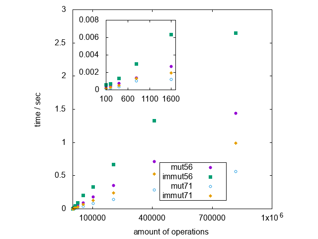

# Immutable Objects Benchmark

This repository provides you with a benchmarking script to check
the difference in execution time and memory consumption for setter
operations (will be refered to as "operations" below) on mutable
and immutable objects. We find an increase in execution time,
which does not seem overwhelming. In our case we find an average
time difference of about 1E-6 seconds per operation.
Assuming 10E3 operations per pageload (which is a lot), we expect
that once we have a large offset in execution time due to the
environment (mainly database interactions) it will not be possible
to sense a difference for a user.

Note, the immutable benchmark also serves for purpose of benchmarking
the object generation operation, since at any setter operation a new
object is generated.

Our sample, **class.immutableSample.php**, is a simple object with a
series of public setters. The function of its setters depends on the
**$mutable** property of the object. They may be operated in two
distinct ways:

1. an immutable way. A new immutable object will be created, having a
single property changed according to the setter operation executed,
and returned.

2. a mutable way, i.e. the object itself will be changed and returned.

In **runner.php** we create such an object and perform setter operations
on it. The amount of these operations is variable and the type of any
single operation is chosen randomly at runtime. Thus we hope to represent
a broad variety of usecases with this benchmark. The object, on which
the setter is called, is replaced by the return value of the setter
operation. Please confer class.immutableSample.php for further
information. 

The execution time and memory consumption we capture using PHP's native
**microtime** and **memory_get_usage** functions. We may also capture
reference data in additional runs, in which we perform no setter
operations on the object, just to measure the environmental offset in
execution time and memory consumprion.

The results are presented in the following graph:

Here we see the execution time depending on the numbers of operation for
mutable and immutable objects in php 5.6 and 7.1. Samples were taken on
2,5 GHz Intel Core i5, 8 GB 1600 MHz DDR3, macOS Sierra. As expected, it
takes longer to deal with immutable objects. However, immutable performance
on 7.1 is dlightly better that the mutable on 5.6.

## Disclamer

The code presented in this repository is free for use in any context.
However, no guarantees are given and any usage is at own risk.
